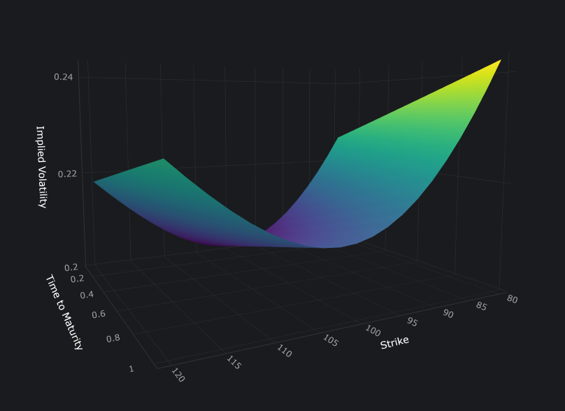

# Volatility Surface Explorer

Interactive 3D implied-volatility surfaces for equity options, driven by the SABR
stochastic-volatility model. Move the SABR and market parameters and watch the
surface update in real time.

**Live demo:** https://volatility-surface-nine.vercel.app

<p align="center">
  <br>
  <em>A symmetric volatility "smile" (common for currencies). A big move is equally likely in both directions so options far from the current price are symmetrically expensive on both sides.</em>
</p>

## Features

- In-house SABR engine (Hagan's expansion) written from scratch in NumPy/SciPy,
  validated against QuantLib to machine precision.
- Black-Scholes-Merton pricing and a Newton-Raphson implied-volatility solver.
- Static no-arbitrage checks (butterfly and calendar-spread) and surface metrics
  (ATM vol, skew, term-structure slope).
- Interactive 3D visualisation with live controls for the SABR parameters
  (alpha, beta, rho, nu) and market inputs (spot, strike range, maturity, grid density).

## How it works

A FastAPI backend generates the surface: for a grid of strikes and maturities it
evaluates the SABR implied volatility at each point, runs arbitrage checks, and
returns the surface as JSON. A React + TypeScript front end renders it with Plotly
and re-fetches whenever you change a parameter.

The project ships two interchangeable SABR implementations behind a small factory:
a custom one (the default) and a QuantLib-backed one used to cross-validate it.

## Tech stack

**Backend:** Python, NumPy, SciPy, FastAPI, QuantLib
**Frontend:** React, TypeScript, Vite, Plotly
**Deployment:** Render (API) · Vercel (frontend)

## Running locally

**Backend** (from the repo root):

```bash
poetry install
poetry run pip install QuantLib        # used by the alternate model and the tests
poetry run uvicorn src.volsurface.api.main:app --reload
```

The API runs on http://localhost:8000.

**Frontend:**

```bash
cd frontend
npm install
npm run dev
```

The dev server defaults to the local API at http://localhost:8000.

## Tests

```bash
poetry run pytest
```

## Project structure

```
src/volsurface/
  core/        Black-Scholes pricing, implied vol, surface generation
  models/      SABR implementations (custom + QuantLib) and a model factory
  metrics/     surface metrics
  api/         FastAPI application
frontend/      React + TypeScript + Vite client
tests/         pytest suite
```
